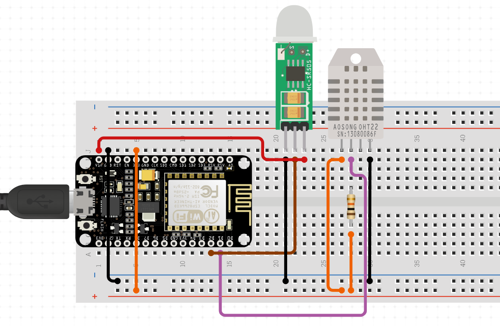

# 🛡️ AI-Based Real-Time Intrusion Detection System on Raspberry Pi

This project integrates **real-time IoT sensor data** with an **AI-based intrusion detection system (IDS)** running on a **Raspberry Pi**. It uses **MQTT**, **Node-RED**, **Prometheus**, and **Grafana** to monitor and detect cyberattacks such as DDoS and packet injection.

---

## ⚙️ Features

- Collect sensor data using ESP8266 over MQTT  
- Analyze network traffic on Raspberry Pi using Scapy  
- Detect DDoS and packet injection attacks via AI (Random Forest model)  
- Visualize live metrics in Grafana  
- Trigger alert emails and Grafana notifications  
- Support for `iptables` flood protection and Cloudflared tunnel  

---

## 📐 System Architecture

<table>
  <tr>
    <th>System Architecture</th>
    <th>Data Collection System Flowchart</th>
  </tr>
  <tr>
    <td></td>
    <td></td>
  </tr>
</table>


```text
[ESP8266 Sensors] → MQTT → Mosquitto Broker (Raspberry Pi)
                                  ↓
                      [Node-RED] → Prometheus Exporter → Grafana Dashboard
                                  ↓
                   Live Packet Sniffer (Scapy) → AI Intrusion Detector → Alert (Email + Grafana)
```

---

## 🧪 Sensor Setup: DHT11 + PIR + ESP8266

<!--  -->
| Senson Integration Circuit Diagram with ESP8266 | Senson Integration with ESP8266 |
|-------------------------------------------------|----------------------------------------------|
|  |  |

---


### 📍 On ESP8266:

- Upload `sensor_publisher.ino` using Arduino IDE
- Configure your Wi-Fi and MQTT broker address
  
---


## 📦 Installation

### 🔧 Raspberry Pi Setup

## 🧰 MQTT Setup (See Mosquitto_setup folder for everything)

```bash
sudo apt update && sudo apt upgrade
sudo apt install python3-pip mosquitto mosquitto-clients
pip3 install scapy pandas joblib prometheus_client
```

---

## 🧰 Node-RED Setup (See Nodered_setup folder for everything)

### Install Node-RED

```bash
bash <(curl -sL https://raw.githubusercontent.com/node-red/linux-installers/master/deb/update-nodejs-and-nodered)
sudo systemctl enable nodered.service
```

### Configure MQTT Node

- Access Node-RED at: `http://<RPI_IP>:1880`
- Install `node-red-contrib-mqtt-broker`
- Drag MQTT input node, parse the JSON, and connect it to Prometheus

#### Flows (Import flows from `Nodered_setup/` folder):

---

## 📊 Prometheus Setup (See Prometheus_setup folder for everything)

### Install

```bash
wget https://github.com/prometheus/prometheus/releases/latest/download/prometheus-*.linux-armv7.tar.gz
tar xvf prometheus-*.tar.gz
cd prometheus-*/
./prometheus --config.file=prometheus.yml
```

### `prometheus.yml` Configuration 

```yaml
global:
  scrape_interval: 5s

scrape_configs:
  - job_name: 'node-red-sensors'
    static_configs:
      - targets: ['localhost:1880']

  - job_name: 'ai_intrusion_detector'
    static_configs:
      - targets: ['localhost:8000']
```

> Save as `prometheus.yml` and restart Prometheus.

---

## 📈 Grafana Setup

```bash
sudo apt install grafana
sudo systemctl enable --now grafana-server
```

- Access Grafana: `http://<RPI_IP>:3000`
- Add **Prometheus** as a data source
- Import dashboard JSON from: `dashboards/grafana_dashboard.json`

---

## 🌐 Cloudflared Tunnel (Optional)

```bash
wget https://github.com/cloudflare/cloudflared/releases/latest/download/cloudflared-linux-arm
chmod +x cloudflared-linux-arm
sudo mv cloudflared-linux-arm /usr/local/bin/cloudflared
cloudflared tunnel login
cloudflared tunnel create ids-tunnel
```

---

## 🧠 AI Model: Intrusion Detection

### Selected Features

```text
['proto', 'src_pkts', 'dst_port', 'dst_pkts', 'src_port', 'packet_frequency', 'dst_bytes', 'src_bytes']
```

### Model Training (Make you own dataset and train your own model in your system for better resulr)

- Dataset: TON_IoT + live `tcpdump` merged
- Model: Random Forest  
- Accuracy: ~99.9%  
- Exported files: `binary_ids_model.joblib`, `binary_scaler.joblib`

---

## 🔍 Live Detection + Email Alert

```bash
python3 scripts/intrusion_detection.py
```

- Captures packets using Scapy  
- Uses `intrusion_detection.joblib` for real-time prediction  
- On attack detection:
  - Sends email via `smtplib`
  - Logs entry to CSV
  - Exposes Prometheus metric (`intrusion_alert`)

---

## 🧪 Attack Simulation (Kali Linux)

### Simulate DDoS (TCP SYN Flood)

```bash
hping3 -S <RPI_IP> -p 1883 --flood
```

### MQTT Injection

```bash
mosquitto_pub -t sensor/data -m '{"temp":999,"motion":5}'
```

---

<!-- ## 🧱 iptables Protection

```bash
sudo iptables -A INPUT -p tcp --syn -m limit --limit 15/second --limit-burst 20 -j ACCEPT
sudo iptables -A INPUT -p tcp --syn -j DROP
``` -->

---

## 🖼️ Sensor Data & Raspbarry Pi Health Visualization

<!-- | Grafana Dashboard |
|-------------------|
|  | -->
<table>
  <tr>
    <th>Reading sensor data from Arduino</th>
    <th>Grafana Dashboard</th>
  </tr>
  <tr>
    <td></td>
    <td></td>
  </tr>
</table>

---

## 🖼️ Attack and Logs Visualization

| Normal & Attack Situations |
|-------------------|
|  |

---

## 🖼️ Alert in Grafana Dashboard & Alert by E-mail Visualization

<table>
  <tr>
    <th>Grafana Alert Dashboard</th>
    <th>Alert by E-mail</th>
  </tr>
  <tr>
    <td></td>
    <td></td>
  </tr>
</table>

---

## 📂 Folder Structure

```text
.
│── Main/
│── ESP8266/
├── README.md
│── Mosquitto_setup/
│── Nodered_setup/
├── Prometheus_setup/
├── Grafana_setup/
├── scripts/
│   ├── intrusion_detection.py
│   └── All_services_enable_start.sh
    └── Iptables_firewall.sh
├── models/
│   ├── binary_ids_model.joblib
│   └── binary_scaler.joblib
├── dataset/
│   └── Use_your_own_dataset.csv
├── screenshots/
│   ├── system_architecture.png
│   └── grafana_view.png
│   └── ---------
│   └── ---------

```

---

## How to run:

- Make sure you do have all the files 
- Go to the `Main/` folder and run the following bash script

```bash
sudo bash main.sh

```

---

## ✅ TODO / Future Enhancements

- Integrate with **fail2ban** for IP banning  
- Explore deep learning models (LSTM, CNN)  
- Enable secure public dashboard hosting via tunneling  

---

## 🙋 Author

**Md. Sourov Ahmed**  
Department of ICT, [Mawlana Bhashani Science and Technology University]  
- GitHub: [@MdSourovAhmed](https://github.com/MdSourovAhmed)  
- LinkedIn: [LinkedIn Profile](https://www.linkedin.com/in/md-sourov-ahmed-661388334)

---

## 📄 License

MIT License — Free to use with attribution.
